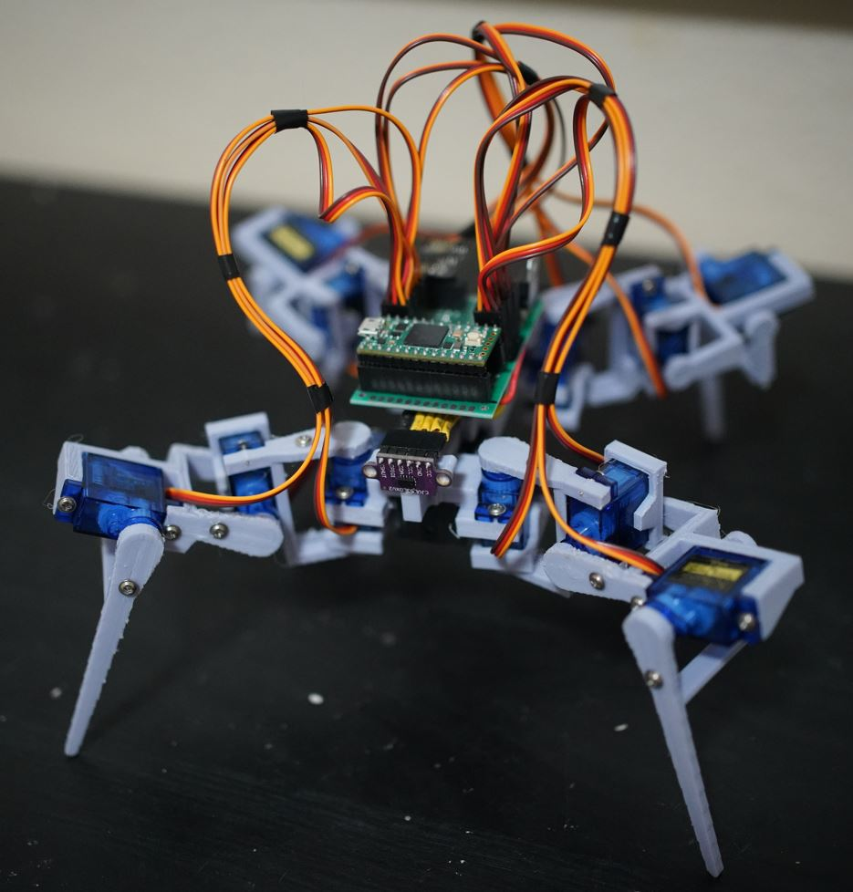
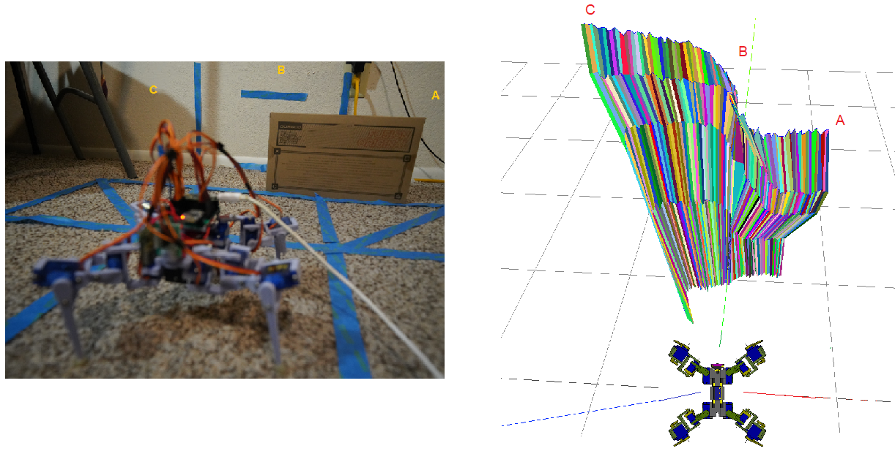
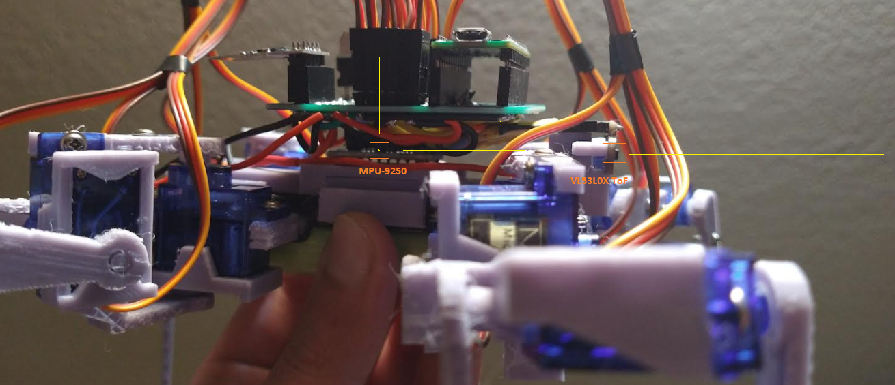
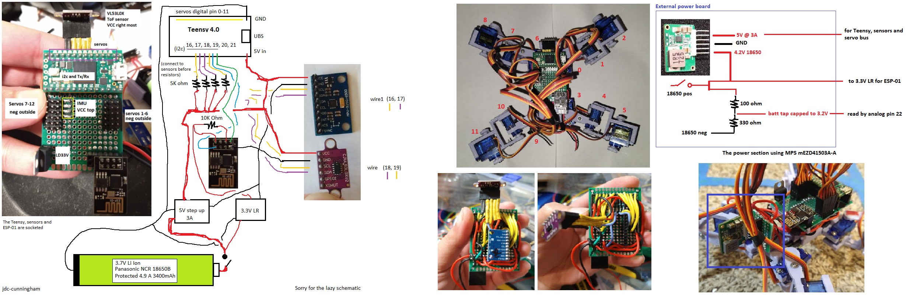

### Twerk Lidar Robot
A robot that utilizes onboard IMU and single-point lidar to navigate the world

### Project status (incomplete)

`dev-3` - current branch

`development` - used hardcoded servo positions/gaits

### What is it

Note: due to the `ToF` sampling rate, the robot moves slower than this while sampling

Example depth map:

### Sensors

### Schematic

### Unit cost estimate: $100+
This is a breakdown of the most expensive stuff on the robot. Does not include the little 3.3V regulator, the 3D printer itself, filament, proto-board, wire, etc...

* $24.00 - 12 x 9g servos
* $20.00 - Teensy 4.0
* $14.00 - MPU-9250
* $14.00 - MPS mEZD41503A-A 5V @ 3A DC/DC converter
* $11.00 - ToF sensor
* $10.00 - NCR 18650B 3.4 Ah 4.9A Protected Button Top Battery
* $3.25 - ESP-01

### Disclaimer - do not reproduce this project
While I have provided everything you need to make this robot, it is not intended to be rebuilt. This project suffers from mathematical inaccuracy both in the physical design and sensor accuracy. It was a good learning tool but this project is still a toy/not reliable to work autonomously.

TL;DR you buy cheap stuff you get cheap performance.

### Development environment

This was developed using Teensyduino so all of the libraries need to be installed there in order for the code to compile.
### Libraries used through Teensyduino IDE library search
* IMU MPU9250 (Bolderflight set, check Readme in case more added)
  * MPU9250
  * Eigen
  * Units
* ToF vl53l0x by Pololu

### Related software for this project
* Google SketchUp for the 3D modeling
* Cura for the slicer

### Related hardware
* Ender 3 Pro for the 3D printer

### About printing
The infill of prints are either 20% or 30%. I have sorted them in folders.

Pretty much anything brittle/small will be 30% or a major structural piece like the main chasis.

### Misc
This project borrows from my [first robot](https://github.com/jdc-cunningham/not-quite-an-ant-robot) with regard to how code is written.
